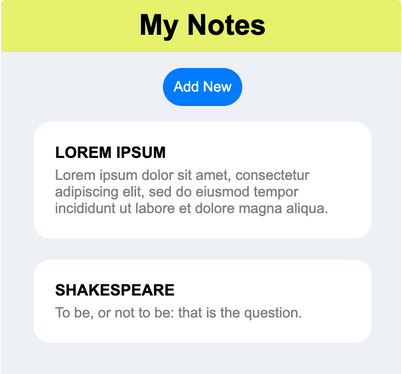

# Welcom to Angular!

Angular is a framework that is used to create scalable web apps with dynamic
content that changes based on a user's interactions.

## What is Angular?

Angular is a development platform and framework.

A development platform provides a range of built-in tools to help you write, 
preview and deploy your projects.

A framework is a structure that you can build on top of and customize.

The three big benefits of Angular are:

    * You can build anything, from simple apps to larger systems
    * You can build faster and with fewer erros thanks to its tools.
    * Angular is actively maintained and has a lare community

Angular was created by Google and is used by thousands of successful brands from Xbox to HBO to BMW.

## Project: Initial Setup

As a practice project, I'm building a Notes app.

The header component has been created for you. Open the code and add an HTML < h1 > heading with the text 'My Notes' to the template of the header component.

Then, import the header component into the root component

Use the <app-header /> tag to reference the component from the root component, instead of the 'Hello from Angular!' heading

